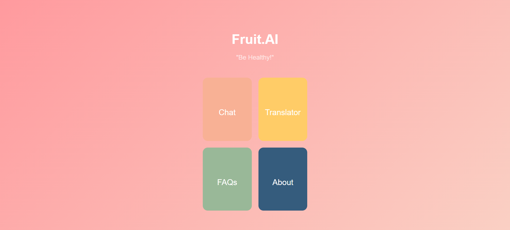
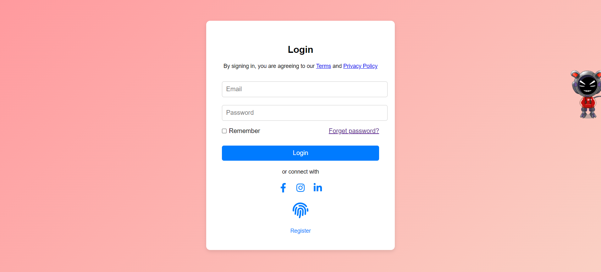
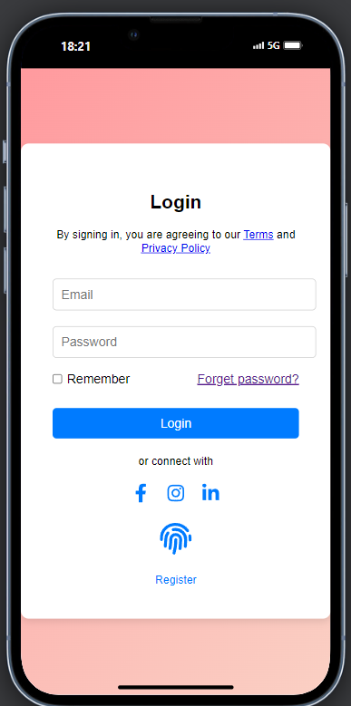
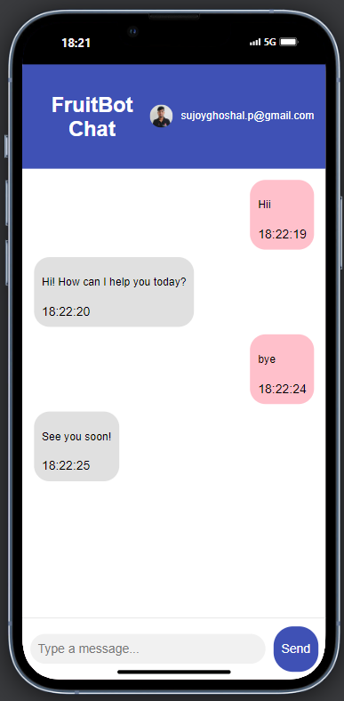
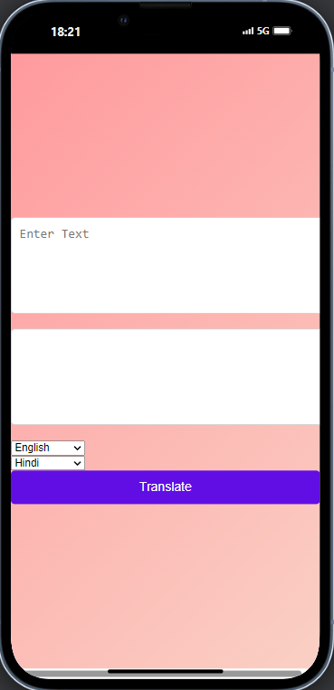
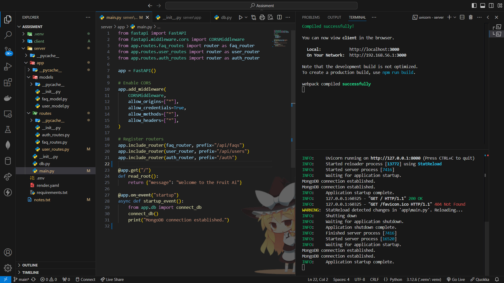

# Fruit.ai - Health Manager
<p align="center">
  
  
  
  
</p>

### Deployment
- **Frontend**: Deployed on **Vercel** at: [https://fruit-ai-clientt.vercel.app/](https://fruit-ai-clientt.vercel.app/)
- **Backend**: Deployed on **Render** at: [https://fruitai-server3.onrender.com/](https://fruitai-server3.onrender.com/)
- **Drive**: Deployed on **Render** at: [https://drive.google.com/file/d/13A8gPtuTM8gTDgGYTqvitIboVHFBcUW4/view](https://drive.google.com/file/d/13A8gPtuTM8gTDgGYTqvitIboVHFBcUW4/view)

## Project Description

Fruit.ai is a health manager application that provides users with various services:
- A chatbot displaying fruit information
- A translator for converting text into regional languages
- A FAQs page related to fruits with full CRUD functionality
- An About page with details about the project

The frontend is built using **React** and the backend API is developed using **Django** with **MongoDB** for data storage. The project is fully responsive and mobile-friendly.

## Login 
--User Signup: New users can sign up and their details will be saved in MongoDB.
--Dummy Login: Admin can log in using predefined credentials (admin and password).

## Preview
Here are some screenshots of the application:

### Homepage


### Login Page
<div style="display: flex; justify-content: space-around; align-items: center; gap: 10px;">
    
    
</div>

<div style="display: flex; justify-content: space-around; align-items: center; gap: 10px;">
    
    
    
</div>

### Another Feature


## Features

- **Login Page**: User Interface with dummy UserId and Password to redirect to the homepage.
- **Home Page**: Contains four services: Chatbot, Translator, FAQ, and About page.
- **Chatbot Page**: Displays a list of fruits as cards. Clickable cards show individual fruit details.
- **Translator Page**: Input text and get translations in a regional language.
- **FAQ Page**: Create, Read, Update, and Delete (CRUD) functionality for FAQs related to fruits.
- **About Page**: Information about the application.

## Tech Stack

### Frontend
- **React**: For building the user interface.
- **CSS**: For styling the components.
- **Axios**: For making API requests.

### Backend
- **Django**: Backend framework in Python.
- **MongoDB**: Database for storing FAQs.
- **Django REST Framework**: For building APIs.
  

## How to Run the Project
### 1. Clone the Repository
First, clone the repository to your local machine:
```bash
git clone https://github.com/your-username/fruit-ai.git
cd fruit-ai

cd ./client
npm install
npm start

cd ./server
python -m venv venv
venv\Scripts\activate
pip install -r requirements.txt
uvicorn main:app --reload
uvicorn app.main:app --reload

